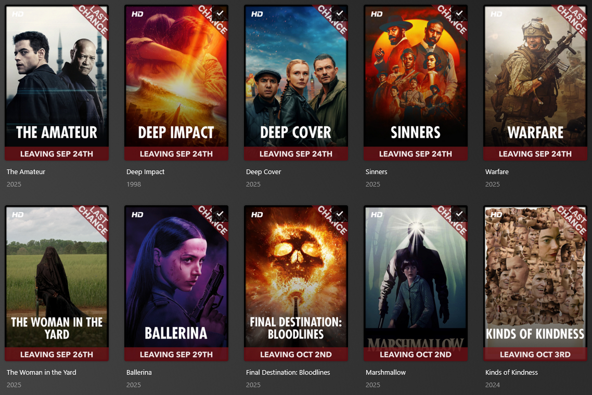
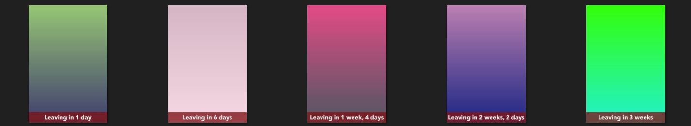

<div align="center">

<h1 align="center">Yamoh</h1>
<b>Yet Another Maintainerr Overlay Helper</b>
</div>

# What is Yamoh?

Yamoh is a C#/.NET 9+ console application that automates the creation of highly configurable poster overlays for Plex media collections managed by [Maintainerr](https://github.com/jorenn92/Maintainerr).

>[!Important]
> **Inspiration:**
> Yamoh was inspired by [gssariev/maintainerr-overlay-helperr](https://github.com/gssariev/maintainerr-overlay-helperr) and [Maintainerr Poster Overlay](https://gitlab.com/jakeC207/maintainerr-poster-overlay) and shares a similar goal of automating poster overlays for Plex collections managed by Maintainerr.
>
> **Key Difference:** Yamoh manages image assets on disk, building a directory structure that mirrors your Plex library for Kometa compatibility, rather than uploading overlays directly to Plex. (Direct Plex upload support may be added in the future.)

### Example of 'Date' OverlayTextMode


### Example of 'DaysLeft' OverlayTextMode


## Features

- **Asset Mode**: works with assets in the specified asset directory (`poster.jpg`, `Season01.jpg`, etc.) compatible with [Kometa](https://github.com/Kometa-Team/Kometa)
- **Collections**: supports all collection types (Movies, TV Shows, Seasons, Episodes), can process multiple collections, and can reorder Plex collections in either ascending or descending depending on expiration date
- **Heirarchy**: can optionally apply overlays to children items (e.g. a tv show, its seasons, and its episodes)
- **Customization**: specify text, color, size, shape, and position of overlay
- **Reversion**: maintains backup of original poster and will revert back to the original poster when the item is removed from the Maintainerr collection, or can revert manually through configuration
- **Automatic Overlay Update**: updates the overlay with any changes from configuration or Maintainerr
- **Text Render Options**: choose between using the item's expiration date (`Date` mode) or days remaining (`DaysLeft` mode)
- **Localization**: (_experimental_) should support localization via the configurable culture string
- **Scheduling**: supports [CRON](https://crontab.guru/) scheduling expressions
- **Manual**: supports manual runs via cli

### Recommended order of Asset management activities


## Platforms
- **Windows x64**
- **Linux x64**
- **macOS x64**
- **Docker Container** (available on Docker Hub: `docker pull smashenter/yamoh:latest`)

## Usage
1. Configure the app using the provided JSON config file and environment variables.
2. Run the app as a console application or in Docker.
3. If Schedule is enabled, overlays will be applied and managed automatically based on Maintainerr collections.

### Manual Commands

Yamoh can be run manually from the command line with the following commands:

#### 1. update-maintainerr-overlays
This is the main command. It processes all Maintainerr collections and applies overlays according to your configuration. This is also the command run automatically when scheduling is enabled.

**Windows:**
```powershell
Yamoh.exe update-maintainerr-overlays
```
**Linux/macOS/Docker:**
```bash
dotnet Yamoh.dll update-maintainerr-overlays
```

#### 2. test-overlay-image
Generates 10 test posters with various expiration dates using your current configuration and saves them in the configured Temp folder. Useful for previewing overlay appearance and verifying configuration.

**Windows:**
```powershell
Yamoh.exe test-overlay-image
```
**Linux/macOS/Docker:**
```bash
dotnet Yamoh.dll test-overlay-image
```

> You can pass additional CLI arguments or override configuration values using environment variables as described above.

## Running Yamoh with Docker

You can run Yamoh using Docker. Make sure to map the `/config` volume so your configuration and state are persisted.

### Using Docker Command

```sh
# Replace /path/to/config with your local config directory
docker run \
  --name yamoh \
  -v /path/to/config:/config \
  -e YAMOH__PLEXURL="http://plex:32400" \
  -e YAMOH__PLEXTOKEN="your_plex_token" \
  -e YAMOH__MAINTAINERRURL="http://maintainerr:6246" \
  smashenter/yamoh:latest
```

### Using Docker Compose

```yaml
version: '3.8'
services:
  yamoh:
    image: smashenter/yamoh:latest
    container_name: yamoh
    environment:
      YAMOH__PLEXURL: "http://plex:32400"
      YAMOH__PLEXTOKEN: "your_plex_token"
      YAMOH__MAINTAINERRURL: "http://maintainerr:6246"
    volumes:
      - /path/to/config:/config
```

- Replace `/path/to/config` with the path to your local config directory.
- All configuration can be set via environment variables or by editing `appsettings.json` in the `/config` directory.

# Configuration

> [!Important]
> All paths (such as TempImagePath, AssetBasePath, BackupImagePath, FontPath) can be specified as either relative to the config directory or as absolute paths.
>
> The config directory is determined at runtime as follows:
> - **Docker:** `/config/`
> - **Windows:** `%ProgramData%\YAMOH\Config` (typically `C:\ProgramData\YAMOH\Config`)
> - **Linux/macOS:** `$HOME/.config/YAMOH/Config` (typically `/home/<user>/.config/YAMOH/Config` or `/Users/<user>/.config/YAMOH/Config`)

> [!Note]
> 1. The application derives configuration values from `appsettings.json` in the config folder and Environment Variables. Any **Environment Variables** that exist will override values in `appsettings.json`.
> 1. Environment variable names use double underscores (`__`) to represent nested config keys.
> 2. For array or list configuration values (e.g., `MaintainerrCollectionsFilter`), environment variables should be set as a comma-separated string. For example:
> `OVERLAYBEHAVIOR__MAINTAINERRCOLLECTIONSFILTER=Movies,Shows,My Custom Collection`

## Basic Configuration

| Config Key                | Environment Variable         | Default Value         | Description |
|---------------------------|-----------------------------|-----------------------|-------------|
| Yamoh:PlexUrl             | YAMOH__PLEXURL              | ""                    | Plex server URL. Include port if required (e.g. `http://plex:32400/`) |
| Yamoh:PlexToken           | YAMOH__PLEXTOKEN            | ""                    | Plex API token. See [Finding a Plex Token](https://support.plex.tv/articles/204059436-finding-an-authentication-token-x-plex-token/) |
| Yamoh:MaintainerrUrl      | YAMOH__MAINTAINERRURL        | ""                    | Maintainerr API URL. Include port if required (e.g. `http://maintainerr:6246`)|
| Yamoh:TempImagePath       | YAMOH__TEMPIMAGEPATH         | "Temp"                | Temporary image folder |
| Yamoh:AssetBasePath       | YAMOH__ASSETBASEPATH         | "assets"              | Base path for asset overlays |
| Yamoh:BackupImagePath     | YAMOH__BACKUPIMAGEPATH       | "assetsbackup"        | Path for backup of original posters |
| Yamoh:FontPath            | YAMOH__FONTPATH              | "Fonts"               | Path to font files |


## Overlay Design Configuration

| Config Key                | Environment Variable         | Default Value         | Description |
|---------------------------|-----------------------------|-----------------------|-------------|
| Overlay:FontName            | OVERLAY__FONTNAME              | "AvenirNextLTPro-Bold"| Font name for overlay text |
| Overlay:FontColor           | OVERLAY__FONTCOLOR             | "#FFFFFF"             | Overlay text color |
| Overlay:FontTransparency    | OVERLAY__FONTTRANSPARENCY      | 0.70                  | Overlay text transparency. Percentage value from 0.00 (Fully transparent) - 1.00 (Opaque) |
| Overlay:BackColor           | OVERLAY__BACKCOLOR             | "#7f161b"             | Overlay background color |
| Overlay:BackTransparency    | OVERLAY__BACKTRANSPARENCY      | 0.70                  | Overlay background transparency. Percentage value from 0.00 (Fully transparent) - 1.00 (Opaque) |
| Overlay:FontSize            | OVERLAY__FONTSIZE              | 75                    | Overlay text font size |
| Overlay:Padding             | OVERLAY__PADDING               | 20                    | Padding around overlay text in background container |
| Overlay:BackRadius          | OVERLAY__BACKRADIUS            | 0                     | Overlay background corner radius |
| Overlay:HorizontalOffset    | OVERLAY__HORIZONTALOFFSET      | 0                     | Horizontal offset for overlay |
| Overlay:HorizontalAlign     | OVERLAY__HORIZONTALALIGN       | "center"              | Horizontal alignment. left, center, right |
| Overlay:VerticalOffset      | OVERLAY__VERTICALOFFSET        | 0                     | Vertical offset for overlay |
| Overlay:VerticalAlign       | OVERLAY__VERTICALALIGN         | "bottom"              | Vertical alignment, top, center, bottom |
| Overlay:BackWidth           | OVERLAY__BACKWIDTH             | 1920                  | Overlay background width |
| Overlay:BackHeight          | OVERLAY__BACKHEIGHT            | 0                     | Overlay background height |
| Overlay:OverlayText         | OVERLAY__OVERLAYTEXT           | "Leaving"             | Overlay text prefix for date |
| Overlay:EnableUppercase     | OVERLAY__ENABLEUPPERCASE       | true                  | Uppercase overlay text |
| Overlay:Language            | OVERLAY__LANGUAGE              | "en-US"               | Overlay language for rendering the DateTime string. |
| Overlay:OverlayTextMode     | OVERLAY__OVERLAYTEXTMODE       | "Date"                | Mode for rendering the text. `Date` for "{OverlayText}{Date}" like "Leaving Aug 15th" or `DaysLeft` for "{OverlayText}{HumanizedTimeSpan}" like "Leaving in 4 days" |
| Overlay:DateFormat          | OVERLAY__DATEFORMAT            | "MMM d"               | DateTime format for overlay. See [Date and Time Format Strings](https://learn.microsoft.com/en-us/dotnet/standard/base-types/standard-date-and-time-format-strings) for examples |
| Overlay:DateEnableDaySuffix     | OVERLAY__ENABLEDAYSUFFIX       | true                  | Show day suffix in overlay (e.g. 12**th**, 31**st**, etc.) |
| Overlay:DaysLeftMinUnit     | OVERLAY__DAYSLEFTMINUNIT       | "Day"                 | [Humanizer](https://github.com/Humanizr/Humanizer) [TimeUnit enum](https://github.com/Humanizr/Humanizer/blob/main/src/Humanizer/Localisation/TimeUnit.cs) value to use for minimum resolution of Days Left calculation |
| Overlay:DaysLeftMaxUnit     | OVERLAY__DAYSLEFTMAXUNIT       | "Day"                 | Humanizer TimeUnit enum value to use for maximum resolution of Days Left calculation |
| Overlay:DaysLeftPrecision   | OVERLAY__DAYSLEFTPRECISION     | 2                     | Humanizer Granularity of "Days Left" calculation. |


## Behavior Configuration

| Config Key                | Environment Variable         | Default Value         | Description |
|---------------------------|-----------------------------|-----------------------|-------------|
| OverlayBehavior:UseAssetMode        | OVERLAYBEHAVIOR__USEASSETMODE          | true                  | FUTURE: Store overlays in asset directory (true) or manage in Plex (false) |
| OverlayBehavior:ReapplyOverlays     | OVERLAYBEHAVIOR__REAPPLYOVERLAYS       | false                 | Force reapply overlays |
| OverlayBehavior:OverlayShowSeasons  | OVERLAYBEHAVIOR__OVERLAYSHOWSEASONS    | true                  | Apply overlay to a Show's seasons (if Maintainerr collection is Show type) |
| OverlayBehavior:OverlaySeasonEpisodes| OVERLAYBEHAVIOR__OVERLAYSEASONEPISODES | true                  | Apply overlay to a Season's episodes (if Maintainerr collection is Season type, or OverlayShowSeasons == true ) |
| OverlayBehavior:RestoreOnly         | OVERLAYBEHAVIOR__RESTOREONLY           | false                 | Only restore original posters, do not apply overlays. Helpful to roll back changes made by this application |
| OverlayBehavior:SortPlexCollections | OVERLAYBEHAVIOR__SORTPLEXCOLLECTIONS   | true                  | Should the script sort the Maintainerr collections in Plex according to leaving date?  |
| OverlayBehavior:SortDirection       | OVERLAYBEHAVIOR__SORTDIRECTION         | "Asc"                 | Valid: "Asc" or "Desc"      |
| OverlayBehavior:ManageKometaOverlayLabel | OVERLAYBEHAVIOR__MANAGEKOMETAOVERLAYLABEL  | false        | Remove the Kometa-specific label `Overlay` from Plex items when making changes. This informs Kometa to re-apply its own overlays and update the poster from assets. |
| OverlayBehavior:MaintainerrCollectionsFilter | OVERLAYBEHAVIOR__MAINTAINERRCOLLECTIONSFILTER | [] (empty list) | List of Maintainerr collection titles to process. If empty, all active collections with 'DeleteAfterDays' set will be processed. Use to restrict overlays to specific collections by name. |


## Schedule Configuration

| Config Key                | Environment Variable         | Default Value         | Description |
|---------------------------|-----------------------------|-----------------------|-------------|
| Schedule:Enabled          | SCHEDULE__ENABLED            | true                  | Enable scheduled overlay runs based on cron schedule. Otherwise Yamoh only works with cli arguments. |
| Schedule:RunOnStart       | SCHEDULE__RUNONSTART         | false                 | FUTURE: Run overlay manager on app start. Run on app start, and on cron schedule afterwards |
| Schedule:OverlayManagerCronSchedule | SCHEDULE__OVERLAYMANAGERCRONSCHEDULE | "30 * * * *" | Cron schedule for overlay manager.|
| Logging:MinimumLevel:Default                    | LOGGING__MINIMUMLEVEL__DEFAULT                         | Information                  | Default minimum logging level.    |

## Contributing
Pull requests and issues are welcome! Please see `.github/ISSUE_TEMPLATE` for bug reports.

## License
MIT
